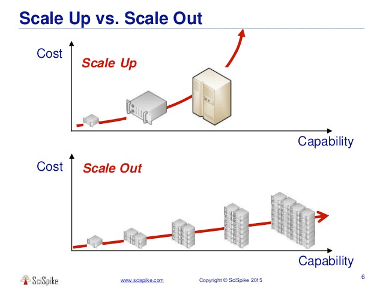
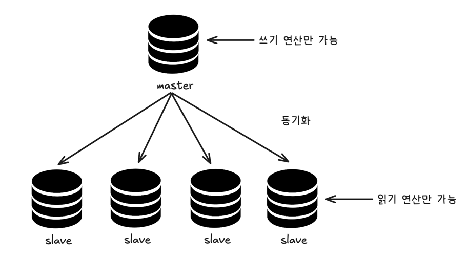
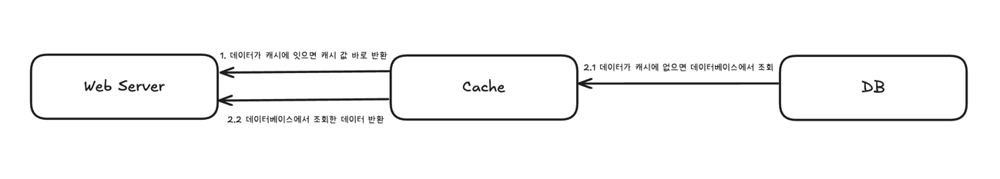
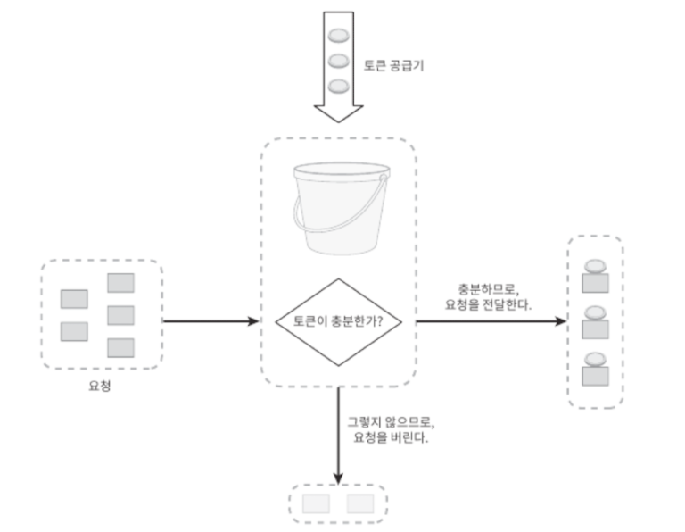
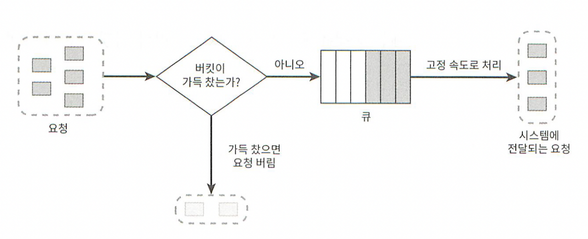
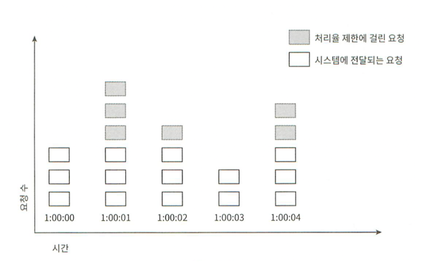
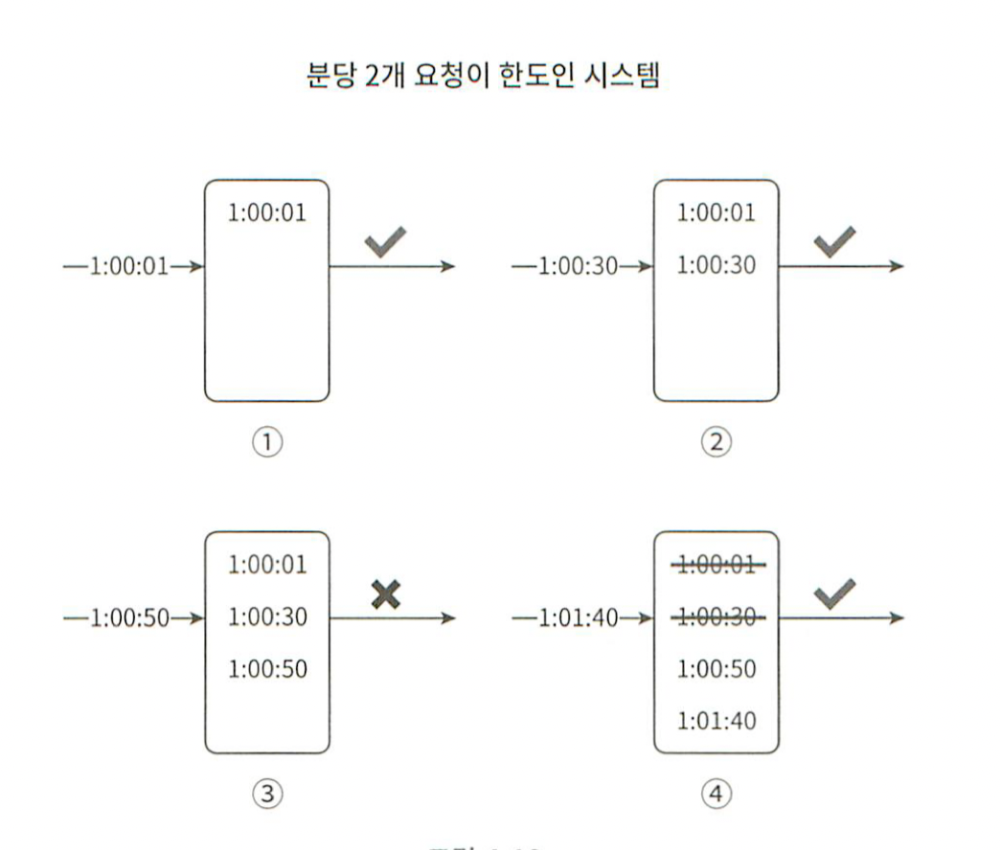

# 1장 : 사용자 수에 따른 규모 확장성

## 수직적 규모 확장 vs 수평적 규모 확장
### 수직적 규모 확장 (Scale Up)
- 서버에 고사양 자원을 추가하는 것
- 한 대의 서버에 CPU 혹은 메모리를 무한대로 설정할 수 없음
- 자동복구, 다중화에 대한 방안 없음


### 수평적 규모 확장 (Scale Out)
- 더 많은 서버를 추가하는 것
- 대규모 애플리케이션에서 적절한 방식
- 로드 밸런서를 사용하여 자동복구, 다중화를 지원



## 로드 밸런서
- 트랜픽을 고르게 분산하는 역할
- 수평적으로 확장된 애플리케이션에서 활용
- 서버 집합에 대해 들어오는 트래픽을 고르게 분산 (다중화)
- 서버 집합에서 특정 서버가 다운되더라도, 로드 밸런서는 해당 서버를 제외한 나머지 서버로 트래픽을 분산 (자동복구)

> 서버 레벨에서는 수평적 확장과 로드 밸런서를 통해 다중화와 장애복구 구현이 가능해짐
> 데이터베이스 계층에서도 다중화와 장애복구 구현이 가능할까?

## 데이터베이스 다중화
- `master-slave`관계를 통해 다중화를 지원
- 쓰기 연산은 `master`DB에서만 허용 (insert, update, delete)
- 읽기 연산은 `slave`DB에서만 허용 (select)
- `slave`DB는 `master`DB를 복제



- 데이터베이스 다중화를 통해 쿼리가 분산 -> 성능 향상
- 안정성 : DB를 다중화하였으므로 일부가 파괴되더라도 데이터는 보존됨
- 단점으로는 master-slave간의 데이터가 일치하지 않을 수 있음 (master의 복제가 slave로 update시키기 때문)

- 이와 같은 `master-slave`아키텍처를 통해 데이터베이스가 다운되더라도 자동복구가 가능해짐
> #### 1️⃣ 부 DB(slave)가 한 대 뿐인데 다운된 경우
> 주 DB(master)가 읽기 연산까지 일시적으로 담당
> 
> #### 2️⃣ 주 DB(master)가 다운된 경우
> 부 DB(slave)가 주 DB로 승격 -> 새로운 부 DB 생성
> 이때 부 DB의 데이터가 최신 상태가 아닐 수 잇음 -> 이를 해결하기 위한 recovery script가 필요


## 캐시
- 메모리에 연산 결과 혹은 데이터를 적재하고, 뒤이은 요청들이 해당 데이터를 필요로 할 시 바로 사용할 수 있도록 하는 기술
- 기본적으로 데이터베이스 연산은 시간이 오래걸리기에 메모리에 데이터를 위치시킴으로써 조회의 성능을 높임

### 캐시 계층
- 캐시가 저장되는 곳
- 데이터베이스에서 데이터를 조회하기 전에 캐시 계층에서 데이터가 존재하는지 확인


1. 캐시에 데이터가 잇으면 데이터 반환
2. 1 캐시에 데이터가 없으면 데이터베이스에서 데이터 조회
2. 2 데이터베이스에서 조회한 데이터 반환

- 이러한 방식을 `캐시 우선 읽기 전략`이라고 함
- 더 많은 캐싱 전략 -> https://codeahoy.com/2017/08/11/caching-strategies-and-how-to-choose-the-right-one/

### 캐시 사용 시 유의해야할 점
- 변경이 자주 일어나는 데이터는 캐싱해선 안됨
- 자주 조회되며 변경이 잘 안되는 데이터를 캐싱해야함
- 캐시는 서버가 재시작되면 사라지므로, 영속 데이터는 캐시에 저장해선 안됨
- 캐시 만료기한을 너무 짧지도, 길지도 않은 적당한 기한으로 설정해야함 (너무 짧으면 캐시가 기능하지 못함, 너무 길면 원본 데이터와 차이가 남)
- 캐시 서버를 한 대만 둘 경우, 장애가 발생할 수 있으므로 다중화해야함
- 캐시 메모리가 너무 작으면 캐시 성능이 떨어짐

### CDN (Content Delivery Network)
- 정적 콘텐츠인 이미지, 비디오, JS, CSS 등을 캐싱할 수 있도록 하는 기술
- 지리적으로 가까운 서버에 복제 저장하여 더 빠르게 정적 데이터를 가져올 수 있음
- 쉽게 말해서, 애플리케이션 내에서 캐싱 처리하는게 아닌 지리적으로 가까운 위치에서 캐싱을 해줌

#### CDN 사용 시 고려해야할 점
- 제3 사업자를 통해 운영되는 기술이므로, CDN에 올라가는 컨텐츠의 제거, 혹은 버전 관리를 따로 API를 통해 관리해야함 
- 그리고 엄청 비쌉니다..


## 무상태 웹 계층
- 수평적 확장을 위해서는 무상태 웹 계층이 필수
- 어떠한 요청이라도 모든 서버에서 처리할 수 있어야함
- 만약 각 서버가 메모리에 각각 다른 정보를 담고 잇다면, 담고 있는 정보에 해당하는 요청만 처리할 수 있음
- 예) 세션 데이터
- 즉 웹 서버들이 공유할 수 있는 세션 저장소가 필요
- Redis, NoSQL 같은 것이 세션 저장소가 될 수 있음


## 데이터 센터
- 전 세계 사용자에게 안정적이고 빠른 서비스를 제공하기 위한 글로벌 분산 아키텍처 설계
- 리전을 대상으로 로드 밸런싱이 진행됨 (아까 언급한 로드밸런싱은 하나의 리전에서 여러 웹 서버를 분산) 
- 이때 지리적 위치를 기반으로 어떤 데이터센터(리전)으로 라우팅이 되는지 결정됨
- 이때 장애 발생 시 트래픽 우회, 데이터베이스간의 데이터 동기화, 테스트와 배포 등을 고려해야한다. 


## 메세지 큐
- 비동기 통신을 지원하는 컴포넌트이다.
- 생산자에서 소비자로 메세지 큐를 통해 데이터가 전달된다. 이때 메세지 큐에 일단 보관된 메세지는 소비자가 꺼내기 전까지는 안전하게 보관된다.
- 메세지 큐를 통해 서버 간의 결합이 느슨해지고, 여러 개의 소비자를 설정하여 수평적 확장에도 용이함
- 오래 걸리는 작업에 대해 소비자로 하여금 비동기적으로 처리하도록 하여 각 서비스의 규모를 독립적으로 확장 가능


## 데이터베이스의 규모 확장
- 두 가지 방식 존재 수직적 확장, 수평적 확장
#### 수직적 확장
- 데이터베이스에 고성능 자원을 증설하는 것
- 무한히 증설할 수는 없음
- 단일 장애 (SPOF)가 발생하여 전체 시스템이 멈출수도 있음

#### 수평적 확장 - 샤딩
- 대규모 데이터베이스를 샤드라는 작은 단위로 분할하는 기술
- 샤드는 모두 같은 스키마 사용, but 샤드끼리 중복되는 데이터 존재하지 않음
- 데이터 저장 시, 존재하는 샤드 중 하나에 저장됨
> #### 예시)
> (사용자ID % 4)의 값에 따라 사용할 샤드를 정할 수 있음
> 사용자ID % 4 == 0 이면 0번 샤드에 저장
> 사용자ID % 4 == 1 이면 1번 샤드에 저장
> 이를 통해 모든 샤드에 균일한 데이터 저장이 가능

#### 샤딩 시 유의해야할 점
- 데이터의 재샤딩 필요성 : 데이터가 많아져 샤드가 소진되면 샤드를 추가하여 재샤딩이 필요함
  - 안정 해시 기법을 통해 문제 해결 가능
- 유명인사 문제 : 특정 샤드에 쿼리가 집중되어 서버에 과부하가 걸릴 수 있음
  - 쿼리가 많은 데이터를 각 샤드에 균등하게 분배해야함
- 조인과 비정규화 : 샤드로 나뉘어지면, 테이블 간의 조인이 힘들어짐 -> 한 테이블에서 연관된 데이터를 쿼리할 수 있도록 비정규화를 수행해야함

---

# 4장 : 처리율 제한 장치의 설계

### 처리율 제한 장치 (rate limiter)
- 클라리언트가 보내는 트래픽의 처리율을 제어하기 위한 장치
- 임계치를 넘어서면 모든 호출은 처리 중단
> 예시)
> 1. 사용자는 초당 2회 이상 새 글 업로드 X)
> 2. 같은 IP주소로 10개 이상의 계정 생성 불가

### 처리율 제한의 이점
#### 1. Dos 공격에 대한 자원 고갈 방지
- 과도한 요청에 대해 처리를 중단하여 Dos 공격을 방지

#### 2. 비용 절감
- 필요없는 추가 요청에 대한 처리를 제한하여, API 요청으로 선형적으로 증가하는 비용을 절감

#### 3. 서버 과부하 방지
- 과도한 트래픽이 서버로 몰리는 것을 방지하여 과부하를 방지

### 처리율 제한 장치의 위치
- 클라이언트 측 : 쉽게 위변조가 가능하기에 처리율 제한이 안정적으로 걸리지 않음
- 서버 측 : API 서버 안에서 처리율을 제한
  - 서버 내로 요청이 들어옴
- 미들웨어 (클라이언트 - 서버 중간) 측 : 처리율 제한 장치를 미들웨어에 둠
  - API 서버로 가능 요청을 통제 (서버 내로 들어오지 않음)
  - ex) 보통 API 게이트웨이에서 처리율 제한 장치를 구현함


## 관련 알고리즘
- 처리율 제한 장치를 구현하기 위한 알고리즘
### 토큰 버킷 알고리즘
- 가장 폭넓게 이용되는 알고리즘
- 일정한 용량의 토큰 버킷에 토큰이 주기적으로 채워짐 (버킷이 가득 차면 토큰은 버려짐)




> #### 동작 방식
> 1. 모든 요청은, 하나의 토큰을 받아야 처리될 수 있음
> 2. 요청이 토큰 버킷을 검사해서 충분한 토큰이 있으면, 토큰 하나를 꺼낸 후 통과
> 3. 충분한 토큰이 없으면, 해당 요청은 버려짐
> 4. 이를 통해, 토큰이 주기적으로 얼마나 채워지냐에 따라 처리율을 조절할 수 있음

- API 엔드포인트 하나 당 한 개의 버킷을 필요로 함
- 즉, 처리율을 제한하고자 하는 API 개수만큼 버킷을 설정해야함

#### 장점
- 구현이 쉬움
- 메모리 측면에서 효율적임 (API 개수만큼 버킷이 생기는데도..?)
- 짧은 타임 동안의 트래픽도 처리 가능

#### 단점
- 버킷 크기, 토큰 공급률 두 개의 인자를 적절히 설정해야함


### 누출 버킷 알고리즘
- 토큰 버킷 알고리즘과 비슷하지만 요청 처리율이 고정되어 있음
- FIFO 큐를 활용



> #### 동작 방식
> 1. 요청이 도착했을 때, 큐에 요청 추가 (만약 큐가 가득 찼으면 요청 버림)
> 2. 지정된 시간마다 큐에서 요청 처리

- 지정된 시간마다 큐에서 요청을 처리하므로 처리율이 동일함
- 큐에서 몇 개의 요청을 꺼낼 지에 따라 처리율을 결정할

#### 장점
- 큐의 크기가 고정되어잇어 메모리 사용량이 적음
- 처리율이 고정되어있어 안정적인 연산 가능

#### 단점
- 탄력적인 트래픽에 적절히 대응하지 못함 (갑자기 많은 트래픽에 대해 요청을 다 버리게 됨)
- 버킷 크기와 처리율 인자를 조절하기 어려움


### 고정 윈도 카운터 알고리즘


> #### 동작 방식
> 1. 일정 시간마다 일정 크기의 윈도우로 나눔 (윈도우에 카운터를 붙임)
> 2. 요청이 올 때마다 카운터의 값 1씩 증가
> 3. 해당 카운터가 임계치를 넘어설 때부터, 새로운 요청은 새로운 윈도우가 열릴 때까지 버려짐



- 위 사진에서는, 임계치를 3으로 잡았기 때문에 일정 시간에 3개 요청 이후부터는 제한이 걸려 버려짐

#### 장점
- 메모리 효율이 좋음
- 이해하기 쉬움 (예: 1초동안 임계치보다 많이 오면, 임계치 이상부터 자름)
- 특정한 패턴을 인식하기 쉬움

#### 단점
- 만약 시간 경계 사이에 요청이 몰린다면, 짧은 시간 사이에 카운터가 초기화되어 설정한 임계치보다 더 많은 요청이 허용될 수 있음 (최대 2배)


### 이동 윈도 로그 알고리즘
- 고정 윈도 카운터 알고리즘 방식의 단점을 극복한 알고리즘
- 요청의 타임스탬프 (시간정보)를 사용

> #### 동작방식
> 1. 새 요청이 오면 윈도의 시작 시점 보다 오래된 타임 스탬프는 제거
> 2. 새 요청의 타임스탬프를 로그에 추가
> 3. 로그의 크기가 허용치보다 크면, 처리를 거부



- 위 그림에서 분당 최대 2번의 요청을 처리한다고 가정했을 때,
- 3️⃣번에서, 이미 2번의 요청이 처리되었으므로 요청이 제한된다. (로그는 기록된다.)
- 4️⃣번에서, 새로운 윈도로 변경되었으므로 해당 윈도우의 전 타임스탬프를 가진 로그는 삭제된다.
- 그 후, 남은 2개의 요청이 처리된다.

#### 장점
- 모든 시점의 윈도에서, 시스템의 처리율 한도를 넘지 않음

#### 단점
- 다량의 메모리를 사용 (거부된 요청의 타임스탬프도 보관)


### 이동 윈도 카운터 알고리즘
- 고정 윈도 카운터 알고리즘과 이동 윈도 로깅 알고리즘을 결합한 알고리즘 
- 


## 설계

### 처리율 초과 트래픽 처리
- 한 요청이 한도 제한에 걸리면 `429 Too Many Reqest`를 클라이언트로 보냄
- `X-Ratelimit-Remaining` : 윈도 내에 남은 처리 가능 요청의 수
- `X-Ratelimit-Limit` : 매 윈도마다 클라이언트가 전송할 수 있는 요청의 수
- `X-Ratelimit-Retry-After` : 몇 초 뒤에 요청을 다시 보내야 하는지 알림


### 멀티 스레드 환경에서의 처리율 제한 장치 - 두 가지 이슈
#### 1. 경쟁 조건
- 카운터의 값을 읽어 1씩 증가시키는 구조
- 즉, 동시성이 심해지면 데이터의 일관성이 깨질 수 있음
- 이를 해결하기 위해 락 사용 -> 동시성을 떨어뜨림
> #### 해결 방안
> 1. Lua script를 작성
> 2. 정렬 집합 (redis) 자료구조 사용


#### 2. 동기화


## 처리율 제한 장치를 어떻게 구현해야할까?
### 1. Nginx 레벨에서 적용하는 방법
- `limit_req_zone` 변수 활용
``` groovy
http {
    # 1초에 10개의 요청만 허용하는 버킷 정의
    limit_req_zone $binary_remote_addr zone=api_limit:10m rate=10r/s;
}
```

- 요청이 제한을 초과하면, 429 `Too Many Request` 반환
```groovy
location /api/ {
    limit_req zone=api_limit burst=20;
    limit_req_status 429;  # 429 Too Many Requests 로 응답
    proxy_pass http://localhost:8080;
}
```

### 2. Spring 레벨에서 적용하는 방법
- 구글 `Guava`의 `RateLimiter` : 토큰 버킷 기반 알고리즘
```java
@Component
public class ApiRateLimiter {
    private final RateLimiter rateLimiter = RateLimiter.create(5.0); // 초당 5개 요청

    public boolean allowRequest() {
        return rateLimiter.tryAcquire();
    }
}
```