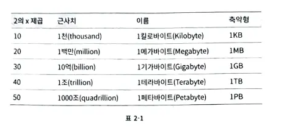
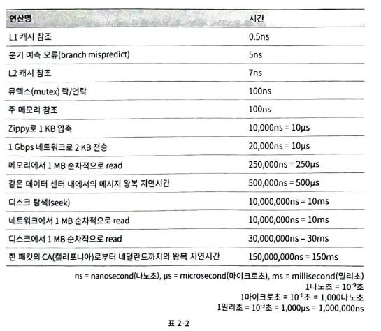
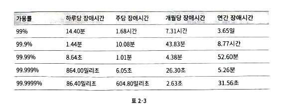
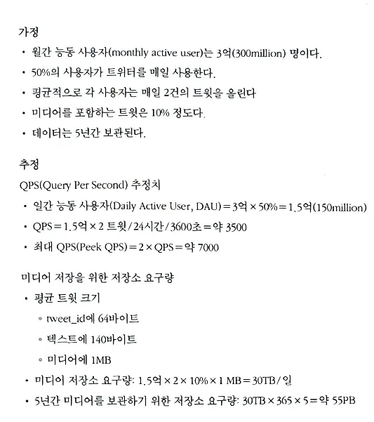

개략적인 규모 추정은 사고실험을 통해 추정치를 계산하여, 어떤 설계가 요구사항에 부합할 것인지 판단하는데 사용

개략적인 규모 추정을 효과적으로 해내려면 규모 확장성을 표현하는데 필요한 기본기에 능숙해야 한다. 특히, 2의 제곱수나 응답지연값, 가용성에 관계된 수치를 잘 이해해야 한다.

- 2의 제곱수

  분산 시스템에서 다루는 데이터 양은 엄청나게 커질 수 있으나 그 계산법은 기본을 크게 벗어나지 않는다. 제대로 된 계산 결과를 얻으려면 데이터 볼륨의 단위를 2의 제곱수로 표현하면 어떻게 되는지를 우선 알아야 한다.ASCII 문자 하나가 차지하는 메모리 크기가 1바이트이다.

    

- 응답지연 값

    

  제시된 수치들을 분석하면 다음과 같은 결론이 나온다.

    - 메모리는 빠르지만 디스크는 아직도 느리다.
    - 디스크 탐색(seek)은 가능한 한 피하라
    - 단순한 압축 알고리즘은 빠르다.
    - 데이터를 인터넷으로 전송하기 전에 가능하면 압축하라
    - 데이터 센터는 보통 여러 지역(region)에 분산되어 있고, 센터들 간에 데이
      터를 주고받는 데는 시간이 걸린다.
- 가용성과 관계된 수치

  고가용성은 시스템이 오랜 시간 동안 지속적으로 중단 없이 운영될 수 있는 능력을 지칭하는 용어이다.

  값은 퍼센트(percent)로 표현하는데, 100%는 시스템이 단 한 번도 중단된 적이 없었음을 의미한다. 대부분의 서비스는 99%에서 100% 사이의 값을 갖는다.

  

  가용성 99.9%를 3nine이라고 부르기도 한다.

- 트위터 QPS와 저장소 요구량 추정

  

  개략적인 규모 추정과 관계된 면접에서 가장 중요한 것은 문제를 풀어 나가는 절차다.

몇가지 팁을 주자면

- 근사치를 활용한 계산(rounding and approximation)
    - 면접장에서 복잡한계산을 하는 것은 어려운 일이다.
    - 그러니 적절한 근사치를 활용하여 시간을 절약하자. “99987 / 9.1” 은 "100,000 / 10"로 간소화할 수 있다
    - 나중에 살펴볼 수 있도록 가정(assumption)들은 적어 두라.
    - 단위(unit)를 붙이라. 5라고만 적으면 5KB인지 5MB인지 알 수가 없다.
    - 많이 출제되는 개략적 규모 추정 문제는 QPS, 최대 QPS, 저장소 요구량, 캐시 요구량, 서버 수 등을 추정하는 것이다.